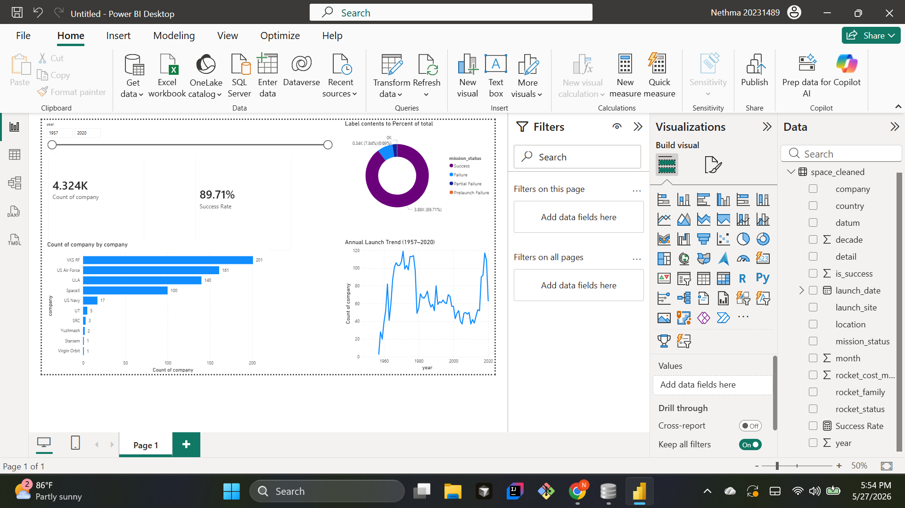

# 🚀 Space Exploration Analytics (1957–2020)

> Analysing 4,324 rocket launches across 6 decades to uncover 
> trends in space industry growth, mission reliability, and the 
> rise of commercial spaceflight.

## 📊 Dashboard Preview

## 🔍 Key Findings
- Overall mission success rate: **89.7%** across 63 years
- Launch volume **doubled post-2015** driven by SpaceX
- ULA leads reliability at **99.3%** success rate
- Soviet programmes account for **41%** of all launches

## 🛠️ Tech Stack
| Tool | Purpose |
|------|---------|
| Python / Pandas | Data cleaning & EDA |
| Matplotlib / Seaborn | Visualizations |
| SQLite / SQL | KPI queries |
| Power BI | Interactive dashboard |

## 📌 Dataset Source
[Kaggle — All Space Missions from 1957](https://www.kaggle.com/datasets/agirlcoding/all-space-missions-from-1957)
